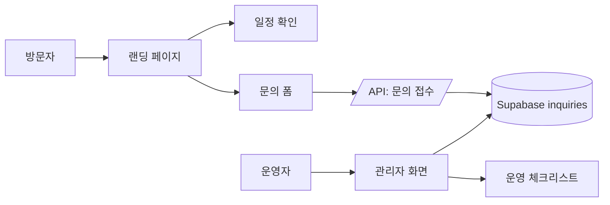
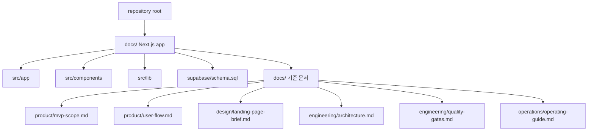
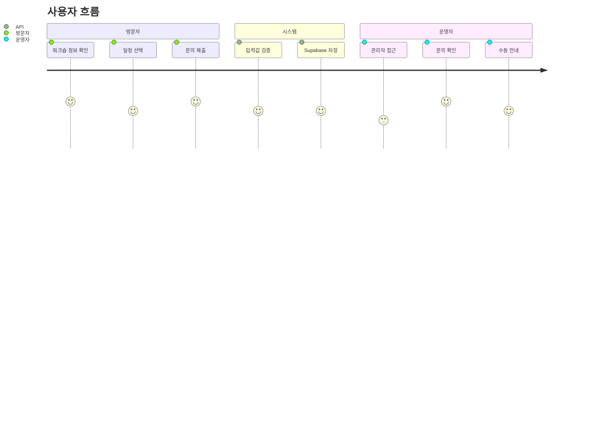
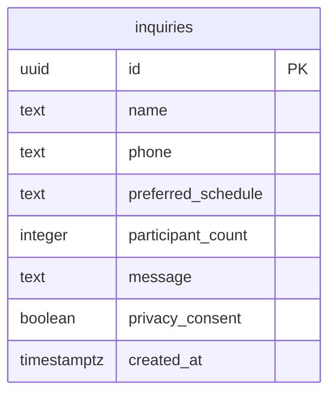

# 작은 워크숍 랜딩

소규모 오프라인 워크숍의 안내, 문의 접수, 운영자 확인을 위한 Next.js MVP입니다.



## 구조



## 화면



## 데이터



## 실행

```bash
cd docs
npm install
npm run dev
```

## 품질

```bash
cd docs
npm test
npm run build
```

## 기준 문서

| 기준   | 문서                                                                                 |
| ------ | ------------------------------------------------------------------------------------ |
| 범위   | [`docs/docs/product/mvp-scope.md`](docs/docs/product/mvp-scope.md)                   |
| 흐름   | [`docs/docs/product/user-flow.md`](docs/docs/product/user-flow.md)                   |
| 디자인 | [`docs/docs/design/landing-page-brief.md`](docs/docs/design/landing-page-brief.md)   |
| 구조   | [`docs/docs/engineering/architecture.md`](docs/docs/engineering/architecture.md)     |
| 검증   | [`docs/docs/engineering/quality-gates.md`](docs/docs/engineering/quality-gates.md)   |
| 운영   | [`docs/docs/operations/operating-guide.md`](docs/docs/operations/operating-guide.md) |

## 다음 작업 체크

- [ ] `docs/.env.example` 기준으로 Supabase 환경변수 확인
- [ ] `docs/supabase/schema.sql` 적용 여부 확인
- [ ] `npm test` 통과 확인
- [ ] `npm run build` 통과 확인
